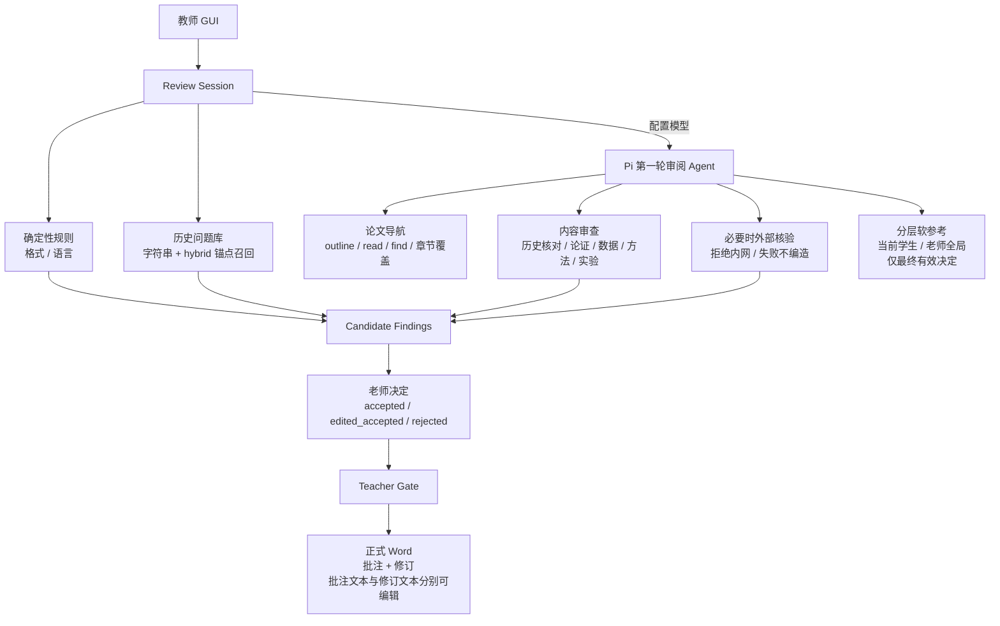

# 论文审稿助手 · Thesis Review Agent

> 面向教师的本科毕业论文本地 Word 审稿工作台。AI 负责第一轮发现问题，老师负责最终判断；只有老师确认过的意见，才会进入正式学生稿。

**当前版本：V0.7 · 覆盖可查的审稿工作台**

**核心边界：AI 初审只产生候选，不直接改正式稿。** 老师可以逐条确认、编辑后确认或驳回；只有 `accepted` 与 `edited_accepted` 会写入最终 Word。

---

## ⬇️ 老师：直接下载 V0.7

**[下载 GitHub Releases 最新版（V0.7）](https://github.com/Dionysianspirit/thesis-review-agent/releases/latest)**

当前 Windows Release：`v0.7.0`  
发布包：`thesis-review-agent-v0.7.0-windows.zip`

适用环境：

- Windows 10 / 11
- 已安装 Microsoft Word
- 不需要另外安装 Python 或 Node.js

使用方法：

1. 下载并解压 Windows 包。
2. 双击 `论文审改助手.exe`。
3. 如果 Windows SmartScreen 拦截，选择「仍要运行」。
4. 模型密钥可选；密钥只保存在本机 `%APPDATA%\ThesisReviewAgent\`，不会打进安装包，也不会提交到仓库。
5. 排障：界面点「打开日志文件夹」，把 `run.log` / `ops.log` / `error.log` 发出来。日志不含密钥和论文原文。

如果只是想先看流程，可以在界面中使用演示稿。

---

## 教师工作流

V0.7 的产品逻辑不是“AI 自动批改论文”，而是一个 **teacher-gated review workstation**：

1. **准备**  
   填写老师 / 学生 / 专业，选择当前学生 Word；历史稿只作为辅助复查材料。

2. **AI 初审**  
   规则检查和 Agent 第一轮审阅产生候选意见。界面会显示中文进度、当前检查意图、逐步出现的 finding，以及**本章覆盖情况**——哪些章节被实际读过、哪些没检查到，初审结束时一目了然。

3. **老师决定**  
   每条候选都由老师选择：确认、编辑后确认或驳回。编辑后确认时，批注意见和修订替换文本分开编辑；格式类问题可以批量接受，但仍允许单条调整。

4. **生成正式审稿稿件**  
   只有老师认可的意见进入正式 Word。仍处于 `pending` 或已经 `rejected` 的意见不会写入。

这意味着：**AI 可以帮助老师扩大第一轮覆盖面，但不能绕过老师直接形成正式批注或修订。**

---

## V0.7 能做什么

| 能力 | 不配置模型密钥 | 配置模型密钥 |
| --- | --- | --- |
| 学校格式规则 | ✅ 候选 | ✅ 候选 |
| 基础语言规则 | ✅ 候选 | ✅ 候选 |
| 历史问题召回 | ✅ 字符串 / hybrid 锚点召回 | ✅ Agent 进一步核对是否真复犯 |
| 内容审查：论证 / 数据 / 方法 / 实验 / 结构 | ❌ | ✅ 有界第一轮审阅 |
| 章节覆盖记录与剩余预算引导 | ❌（仅模型审阅路径） | ✅ 每章 read / probed / unread 可查 |
| 必要时的外部核验 | ❌ | ✅ 受控检索（拒绝内网目标）；失败时不编造结论 |
| 中文实时进度与 finding 递增 | ✅ | ✅ |
| Review Session 保存与恢复 | ✅ | ✅ |
| 老师确认门 | ✅ | ✅ |
| 正式 Word 批注 / 修订输出 | ✅ 仅老师确认项 | ✅ 仅老师确认项（批注与修订文本可分别编辑） |
| 模型设置持久化（含思考深度） | ✅ | ✅ |

目前确定性学校格式规则主要依据 **大连财经学院 2026 届相关要求**，详见 [`docs/dalian-finance-2026.md`](docs/dalian-finance-2026.md)。

---

## 为什么必须有“老师确认门”

论文审稿不是适合让模型直接落盘的场景。

V0.7 把 AI 输出和正式 Word 写入拆成两个阶段：

```text
学生 Word
   ↓
规则 + Agent 第一轮审阅
   ↓
候选 Findings
   ↓
老师确认 / 编辑后确认 / 驳回
   ↓
Teacher Gate
   ↓
正式学生 Word
```

程序层会阻止第一轮 Agent 直接调用正式写入路径。只有进入老师决定阶段并满足状态条件后，批注与修订才允许落盘。

因此项目的原则不再是“模型发现什么就写什么”，而是：

> **AI 负责发现和取证，老师负责裁决，程序负责执行边界。**

---

## 历史问题不是自动判“复犯”

历史稿和老师过去的批注会进入复查链路，但历史命中首先只是 **recall candidate**。

典型情况：老师曾批注“结论缺少实验依据”。新稿里出现相似内容时：

- 离线能力先召回可能相关的位置；
- 有模型密钥时，Agent 可以继续阅读上下文并判断是否还是同一类问题；
- 最终仍进入老师候选列表；
- 老师确认后，才允许进入正式审稿稿件。

这样可以避免仅因为标题、短句或旧问题关键词再次出现，就自动给学生贴上“又犯了”的结论。

---

## V0.7 架构



### Python 负责什么

- DOCX 读取、复制、批注与修订写回
- 学校格式和基础语言规则
- 历史问题存储、召回和学生范围隔离
- Review Session 持久化
- quote / 原文等程序级校验
- 工具预算和写入边界
- Teacher Gate 与正式导出

### Pi Agent 负责什么

- 管理模型调用和 tool calling
- 根据论文结构决定下一步读哪里
- 阅读局部章节并形成第一轮候选
- 核对历史问题是否仍然成立
- 检查论证、数据、方法、实验和结构问题
- 必要时进行受控外部核验
- 证据不足时选择不形成候选

Pi 不是 Word 写入器，也不能绕过 Teacher Gate。

---

## Review Session

V0.6 引入了可恢复的审稿会话（V0.7 沿用并扩展），用来保存当前审稿过程中的状态，包括候选、老师决定、历史召回和必要的运行信息。

这使老师可以：

- 中途退出后继续处理候选；
- 把 AI 第一轮和老师最终决定分开；
- 在候选尚未处理完时阻止正式导出；
- 从已保存 Session 重新生成正式稿。

API Key 不会写进 Session 快照。

---

## 当前验证到什么程度

### 自动化测试

仓库 CI 会运行：

```bash
python -m pytest tests -q
```

覆盖范围包括：

- Word 批注与修订适配
- 历史问题入库、召回、确认和隔离
- Teacher Gate
- Review Session
- GUI 四阶段工作流（含章节覆盖摘要条、批注/修订双编辑框）
- Agent 工具链 faux 场景
- 打包后 EXE 的 worker / Pi 链路
- 老师决定前不得出现正式批注或修订
- 老师确认后才生成正式批注 / 修订
- V0.7 新增：章节覆盖记录与预算引导、候选质量门（空泛意见拒绝、高风险章节未读拒绝）、hybrid 历史召回（相似不升格复犯）、分层软参考与最终有效决定、修订替换文本独立编辑、外部检索拒绝内网目标与端点回退

### Windows CI 烟测

每个发布包都来自已验证的 Windows CI 构建。该烟测使用 **faux-pi**，用于验证链路，不代表真实模型质量。V0.6.0 构建时的参考数字：

```text
candidates: 14
comments_before: 0
revisions_before: 0
comments_after: 13
revisions_after: 2
agent: faux-pi
worker_tcp_teacher_gate: true
```

`v0.7.0` 发布时以当次 CI 输出为准；这里最重要的是：**老师决定前，正式 Word 中批注和修订都是 0。**

### 文档引擎验证

仓库还保留了 DocxEngine / 中文 Word 操作相关探针与上游测试记录，用来验证批注、中文跨 run 修订以及已有教师修订的保留行为。

---

## 目前还没有完成

请不要把当前版本描述成“已经完成生产级论文自动审稿”。V0.7 仍有明确边界：

- 尚未在真实老师电脑上完成 Microsoft Word 手工验收；
- 尚未使用真模型 + 授权真实学生论文完成系统性的 live eval——**V0.7 的真实模型质量指标（老师采用率、误报率、漏报率）全部未测量**，本轮只交付了让候选更可用的工程收紧与测量挂钩；
- 动态 reasoning 触发（按检查类型自动升降思考深度）只有静态配置框架，是否提高复杂审查质量待评测；
- hybrid 历史召回解决的是“长段落稀释字符相似度”与“数字锚点改写”两类漏召回，完全同义改写仍依赖字符重合，embedding 方案因打包代价暂未引入；
- 尚未完成生产级全文排版兼容性验收；
- 模型能力、费用和数据处理规则仍取决于老师配置的模型服务商。

**没有命中，不代表全文没有问题；CI 通过，也不代表真实模型已经达到可替代老师的审稿质量。**

---

## 下一步：V0.7 真机验收，让真实结果决定 V0.8

### 1. V0.7 相对 V0.6 实际交付了什么

对照 V0.6 README 的候选方向表，逐项如实汇报：

| 优先级 | 候选方向 | V0.7 状态 | 说明 |
| --- | --- | --- | --- |
| P0 | 全文章节 coverage | ✅ 已做 | open_draft 起构建章节表；read 类操作按章标记 read / probed，find_text 只标记 probed；`coverage_status` 工具让 Agent 查询并把剩余预算优先投向未覆盖章节（总预算不变）；导航耗尽与提交时都会点名未覆盖章节；live 摘要条、trace、session quality 全部可查（`chapter_coverage`） |
| P0 | 真实模型质量优化 | ✅ 工程侧已做，质量未测量 | 候选边界收紧：空泛 problem（<6 有效字符）、复制粘贴式 rationale 直接拒绝；数据/方法/实验类候选必须来自实际读过的章节（堵住“只凭 40 字检索片段下结论”）；截断阅读返回续读位置防过早结论；大纲带每章段落数；提示词加入跨章数字核对。真实模型指标待密钥评测 |
| P1 | 复杂内容审查 reasoning 策略 | ⚙️ 框架已做，动态触发未做 | `reasoning` 设置（off/low/medium/high，默认 off 保持 V0.6 行为）贯通 GUI → 请求 → Agent 思考档位，session 快照可复现；按 finding 类型动态升降级需要评测数据支撑，未做 |
| P1 | 真正的语义历史召回 | ✅ hybrid 已做，embedding 未引入 | `hybrid_recall` = 字符 bigram 余弦 + 数字/英文锚点重合加权，量化测试证明长段落稀释场景下 n-gram 漏召回、hybrid 命中，且锚点单独命中不越阈、相似永不自动升格复犯；本地 embedding 模型体积与 EXE 打包代价不可接受，未引入（见 V0.8 候选） |
| P1 | 老师全局 + 当前学生软参考 | ✅ 已做 | `get_teacher_feedback` 返回 items（当前学生）与 global_items（全局，排除当前学生），每条带 layer 与提示；两层都不可升格为硬规则 |
| P2 | Teacher Feedback 最终态整理 | ✅ 已做 | 完整操作日志保留；给 Agent 的软参考改为每条 finding 的最终有效决定（反复操作取最后一条，最终回到 pending 视为未决、不构成信号） |
| P2 | 老师可编辑最终修订文本 | ✅ 已做 | `teacher_final_new` 与批注文本 `teacher_final_text` 拆分；UI 双编辑框、导出时修订用老师替换文本；V0.6 旧会话兼容；Teacher Gate 不变 |
| P2 | Web Search 稳定性与安全 | ✅ 已做 | 拒绝 localhost / 私网 / 链路本地 / 云元数据地址（含 DNS 解析校验）；检索端点回退（html → lite）；结果里的非公网链接过滤；失败仍不编造 |

另有一项不在候选表内的顺手交付：教师工作台 UI 重构为暖纸色人文编辑风（不改变任何流程语义）。

### 2. V0.7 真机验收

建议至少完整跑一篇已经获得授权的真实论文：

1. 在 Windows 10 / 11 双击 `论文审改助手.exe`，确认 GUI 正常启动。
2. 配置真实 API Key（可同时选择思考深度），完整跑完一次 Pi 第一轮初审。
3. 初审结束后先看**章节覆盖摘要**：哪些章读过了、哪些没检查到，与候选意见分布是否对得上。
4. 实际处理候选：**确认 / 编辑后确认（分别改批注与修订替换文本）/ 驳回 / 批量接受格式问题**。
5. 关闭并重新打开程序，确认 API Key、最近论文、Review Session 和老师决定仍能恢复。
6. 生成正式审稿 Word，并用 **Microsoft Word** 打开。
7. 核对：未确认和已驳回意见没有进入正式稿；编辑后确认使用老师最终文本（批注与修订各自生效）；批注 / 修订位置正常；原论文排版没有明显破坏。

如果这里出现 EXE 崩溃、Session 丢失、Teacher Gate 被绕过、驳回意见写入 Word、修订错位等问题，优先修复后再继续后续迭代。

### 3. 建立真实论文质量基线

工程验收通过后，重点不再是“能不能跑”，而是“AI 第一遍审得好不好”。对真实论文记录：

- AI 候选总数
- 老师直接接受率
- 编辑后接受率
- 驳回率 / 明显误报
- 无价值或重复意见
- 老师发现但 AI 漏掉的重要问题
- **章节覆盖与漏检的关系**（quality 里的 `chapter_coverage` 已可直接导出）
- 老师完成第一遍审稿实际节省的时间
- 不同 `reasoning` 档位下的采用率与 token 成本对比

这些指标用来决定 V0.8 应该改哪里，而不是先凭感觉继续增加工具或规则。

### 4. V0.8 候选方向（由 V0.7 真实数据决定取舍）

| 优先级 | 候选方向 | 当前原因 |
| --- | --- | --- |
| P0 | **真实模型质量评测闭环** | 用真机验收数据验证 V0.7 质量门与覆盖引导是否真的提高老师采用率；没有这一步，后续优化都是盲调。 |
| P1 | **动态 reasoning 触发** | 配置框架已就位；按 data/method/experiment 检查动态升降思考档位，需要评测对比数据决定阈值。 |
| P1 | **embedding / hybrid retrieval 扩展** | 若真实复犯漏召回仍高，评估可选依赖的本地 embedding（插件化、默认关闭），或继续增强锚点词汇表。 |
| P1 | **跨章一致性显式检查** | 目前靠提示词驱动；可做成结构化工具（摘要—实验—结论数字对齐表）。 |
| P2 | **增量审阅与缓存** | 多版本论文只重点重审变更段落，复用章节 hash 与已验证证据，降低 token 与延迟。 |

### 5. 研究型迭代框架（可作为未来论文 / Benchmark 路线）

如果后续希望把项目从“可用工具”推进到“可验证的方法”，重点不是继续堆功能，而是建立**可复现 baseline、消融实验和教师人工评测**。只有出现稳定、可重复的提升，才适合声称准确率、召回率、成本或审稿效率有显著改善。

#### 研究问题

| 研究问题 | 想回答什么 |
| --- | --- |
| **RQ1 · Teacher Gate** | Evidence Gate + Teacher Gate 能否显著降低错误意见进入正式学生稿的比例？ |
| **RQ2 · Agentic 全文审阅** | 结构驱动的 Agent 阅读是否比单次全文 Prompt / 固定逐章 Workflow 找到更多真正有价值的问题？ |
| **RQ3 · 历史复查** | 字符串、n-gram、embedding、hybrid retrieval + Agent 上下文确认，哪种方案能更好识别“真复犯”同时降低误报？ |
| **RQ4 · Teacher Feedback** | 老师历史软参考是否能提高老师采用率、减少改写量，同时不放大模型偏见或历史错误？ |

#### 建议 baseline

至少保留这些对照，避免最后只有“新版本 vs 旧版本”的自我比较：

```text
B0  单次全文 LLM Prompt
B1  固定逐章 Workflow
B2  当前 bounded Agent（outline / read / find）
B3  B2 + Evidence Gate
B4  B3 + Teacher Gate
B5  后续 coverage-aware / history-aware / teacher-aware 方案
```

#### 核心指标

| 指标 | 含义 |
| --- | --- |
| Finding Precision | AI 报出的候选里，有多少被老师判断为真实且有价值 |
| Critical Issue Recall | 老师认为重要的问题里，AI 找到了多少 |
| Teacher Acceptance Rate | `(accepted + edited_accepted) / AI candidates` |
| Edited Acceptance Rate | 有多少意见需要老师改写后才能采用 |
| False Positive / Rejection Rate | 明显误报、无价值或错误建议的比例 |
| Final-doc Leakage | 未确认 / 已驳回意见进入正式 Word 的比例；Teacher Gate 目标应为 0 |
| Chapter Coverage | 每章是否被实际读取 / 检查，以及覆盖深度 |
| History Recall@K / Recidivism Precision | 历史召回是否既能找到相关旧问题，又避免把“相似”误判为“复犯” |
| Review Time Saved | 老师完成第一轮审稿实际节省的时间 |
| Token / Latency Cost | 每篇论文的模型 token、调用次数和总耗时 |

#### 优化方向与消融顺序

后续每次最好只改一个主要变量，再和固定 baseline 比较：

1. **Coverage Planner**：先保证每章至少完成一次有效检查，再把剩余预算投入方法、实验、结果、结论等高风险章节。
2. **动态 reasoning**：格式 / 简单语言走低成本路径；数据矛盾、方法—实验—结论关系等复杂问题按需提升 reasoning effort。
3. **Hybrid History Retrieval**：比较字符串、字符 n-gram、embedding、hybrid retrieval，并保留 Agent 上下文确认。
4. **Teacher Feedback Reranking**：拆分老师全局软参考与当前学生软参考，只使用最终有效决定作为主要信号。
5. **Incremental Review / Cache**：多版本论文只重点重审变更段落，并复用章节 hash、embedding 或已验证证据，降低 token 与延迟。
6. **Cross-section Consistency**：显式检查摘要—正文—结果—结论之间的数据、术语和主张是否一致。
7. **受控外部检索**：仅对论文内部无法核验的事实联网，并单独评估外部检索带来的准确率收益、成本和噪声。

#### 实验建议

- 使用**获得授权**的真实论文和历史版本，不把真实论文提交到仓库。
- 先从 20–50 篇建立小规模、可重复的内部 benchmark；有条件再扩大。
- 让老师对 AI finding 做独立标注，尽量避免先看到模型答案后再定义“正确答案”。
- 对关键问题建立人工 gold set，并保留严重程度等级。
- 同一批论文做成 paired comparison，比较不同系统在相同输入上的表现。
- 记录模型、prompt、工具预算、reasoning 配置、token、耗时和版本，保证结果可复现。
- 做 ablation：去掉 coverage、去掉 history、去掉 teacher feedback、去掉 evidence gate，观察各模块到底贡献多少。

#### 可能形成的研究贡献

如果未来实验数据支持，可以围绕以下方向组织论文，而不是只写“做了一个软件”：

1. **Teacher-Gated Agentic Review**：AI 只形成候选，程序证据门 + 教师决策门共同约束正式输出。
2. **Longitudinal Review Memory**：利用学生历次稿件和老师最终决策，支持纵向复查而不是只审单篇文档。
3. **Coverage-aware Long-document Review**：面向长论文的结构化阅读与动态预算，而不是一次性把全文塞进模型。
4. **Human-centered Evaluation**：以老师采用率、重要问题召回、时间节省和最终稿错误泄漏为核心，而不是只看语言生成分数。

> **研究目标和产品目标要分开。** 产品先保证老师能安全使用；研究再证明哪种设计真的提高 precision / recall / teacher acceptance，或者降低 token、延迟和审稿时间。没有真实实验数据前，不提前宣称“准确率提高很多”。

---

## 本地开发

### 环境

- Python 3.12+
- Node.js 22+
- Windows + Microsoft Word（最终 Word 本机验证时）

### 安装与测试

```bash
python -m venv .venv
```

Windows PowerShell：

```powershell
.venv\Scripts\Activate.ps1
python -m pip install -e ".[dev]"
python scripts/fetch_docxengine.py
cd agent
npm ci --omit=dev
cd ..
python -m pytest tests -q
powershell -File scripts/start_gui.ps1
```

### CLI 演示

```bash
python -m thesis_review.cli demo --out artifacts/demo
```

演示会走完整的 Teacher Gate 流程，并生成用于验证的审稿产物。

已有 Review Session 可以重新导出正式稿：

```bash
thesis-review export --session <session-id>
```

### 真实模型 eval

在本机配置模型密钥后：

```bash
python -m thesis_review.cli eval --out artifacts/eval
```

说明见 [`docs/eval-protocol.md`](docs/eval-protocol.md)。真实论文和密钥不应提交到 Git。

---

## Windows 打包

```powershell
powershell -File scripts/build_windows.ps1
```

构建采用 PyInstaller onedir，并把运行所需的 Python 依赖、便携 Node 和 Pi Agent 一起放进发布目录。

主要产物：

```text
dist/论文审改助手/
├─ 论文审改助手.exe
├─ _internal/
├─ agent/
└─ runtime/node/node.exe
```

打包脚本还会执行 smoke checks，避免出现“PyInstaller 成功，但实际 GUI / worker / Pi 链路不能运行”的假成功。

---

## 项目结构

```text
thesis-review-agent/
├─ agent/                         # Pi Agent runtime 与工具编排
├─ python/thesis_review/
│  ├─ checks/                    # 格式 / 语言确定性规则
│  ├─ history/                   # 历史问题与召回
│  ├─ gui/                       # 四阶段教师工作台
│  ├─ word/                      # DOCX 适配、批注与修订
│  ├─ session.py                 # Review Session
│  ├─ service.py                 # 审稿业务入口
│  └─ worker.py                  # Agent 可调用的受控 Python 工具
├─ tests/                        # 自动化测试与模拟用例
├─ docs/                         # 规则、需求、评估协议
├─ evidence/                     # 文档引擎验证记录
└─ scripts/                      # 构建、探针与运行脚本
```

更多文档：

- [`docs/requirements.md`](docs/requirements.md)
- [`docs/dalian-finance-2026.md`](docs/dalian-finance-2026.md)
- [`docs/eval-protocol.md`](docs/eval-protocol.md)
- [`docs/open-source-plan.md`](docs/open-source-plan.md)
- [`evidence/oss-validation.json`](evidence/oss-validation.json)

---

## 隐私与数据

项目默认把真实论文、历史批注、Review Session 和模型设置保存在本机。

仓库不应提交：

- 真实学生论文
- 未脱敏教师批注
- API Key
- 私人历史数据库 / Review Session

如果配置云端模型或外部检索，完成当前判断所需的有限文本可能会发送给对应服务商；具体数据处理规则取决于老师实际配置的 API / Base URL / 服务提供方。

请只在获得授权的情况下处理真实学生论文。

---

## 版本演进

| 版本 | 核心变化 |
| --- | --- |
| V0.1 | GUI、历史问题入库、离线规则、Word 批注与修订 |
| V0.2 | 收紧历史字符串匹配，减少明显误报 |
| V0.3 | 历史问题结构化；模型辅助确认复犯 |
| V0.4 | Pi Agent runtime、主张—证据取证、程序级 Evidence Gate |
| V0.5 | 中文实时进度、设置持久化、真实模型 eval 入口 |
| V0.6 | 教师确认门、Review Session、四阶段教师工作台、有界第一轮审阅、正式 Word 只写老师认可意见 |
| **V0.7** | **章节覆盖可查与预算引导、候选质量门、hybrid 历史召回、分层软参考（最终有效决定）、批注/修订文本分别可编辑、检索安全加固、可配置思考深度、人文编辑风工作台** |

V0.7 不是对 V0.6 的一次换肤，而是让“AI 第一遍读了什么、报出的东西凭什么”变得可观察、可约束：覆盖不再是黑盒，候选有了更硬的取证门槛，老师的两类最终文本（批注与修订）各自可控。**真实模型质量仍未测量，这是 V0.8 之前必须补上的验证债。**

---

## License

本仓库原创代码与文档采用 [MIT License](LICENSE)。第三方项目保留各自许可证，见 [`THIRD_PARTY.md`](THIRD_PARTY.md)。

如果提交测试样例，请只使用模拟内容，或已经获得授权并充分脱敏的数据。